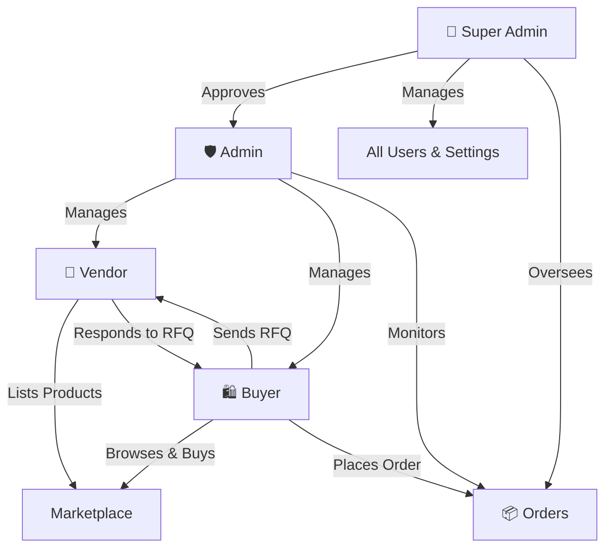
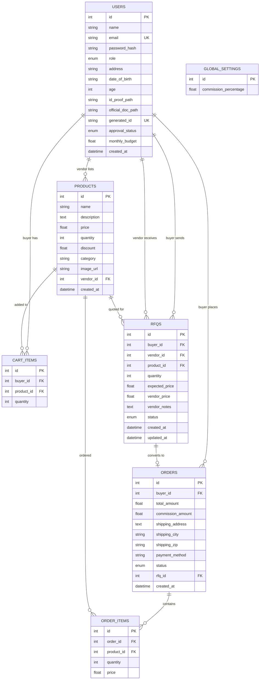

<div align="center">

# 🛒 VENDORA

### A Full-Stack B2B E-Commerce Platform

[](https://fastapi.tiangolo.com/)
[](https://react.dev/)
[](https://vitejs.dev/)
[](https://tailwindcss.com/)
[](https://www.sqlite.org/)
[](https://python.org/)

A robust, role-based B2B e-commerce platform enabling **Vendors** to list products, **Buyers** to browse, negotiate, and purchase, and **Admins / Super Admins** to oversee and manage the entire marketplace — complete with RFQ (Request for Quotation) workflows, order management, analytics dashboards, and commission tracking.

---

</div>

## 📑 Table of Contents

- [Features](#-features)
- [Architecture](#-architecture)
- [Tech Stack](#-tech-stack)
- [Project Structure](#-project-structure)
- [Getting Started](#-getting-started)
- [API Reference](#-api-reference)
- [Role-Based Access](#-role-based-access)
- [Database Schema](#-database-schema)
- [Sprint Documentation](#-sprint-documentation)
- [License](#-license)

---

## ✨ Features

### 🔐 Authentication & Authorization
- JWT-based authentication with bcrypt password hashing
- Role-based access control (Super Admin, Admin, Vendor, Buyer)
- Protected routes with automatic role verification
- 24-hour token expiry with secure HTTP Bearer scheme

### 🏪 Vendor Portal
- **Product Management** — Add, edit, delete products with images, pricing, discounts, and categories
- **Quotation Management** — Receive and respond to buyer RFQs with custom pricing and notes
- **Analytics Dashboard** — Track sales performance, revenue trends, and product metrics
- **Profile Management** — Update business profile and account settings

### 🛍️ Buyer Portal
- **Product Discovery** — Browse and search products across all vendors
- **Shopping Cart** — Add/remove items, update quantities with real-time totals
- **RFQ System** — Request custom quotes from vendors with quantity and expected pricing
- **Order Management** — Place orders, track status (Pending → Confirmed → Shipped → Delivered)
- **Checkout** — Complete purchases with shipping details and payment method selection
- **Analytics** — View spending history, order trends, and budget tracking
- **Monthly Budget** — Set and monitor monthly purchasing limits

### 🛡️ Admin Panel
- **User Management** — Approve, reject, or manage vendor and buyer accounts
- **RFQ Monitoring** — Oversee all quotation activity across the platform
- **Order Oversight** — Monitor and manage all orders with status tracking
- **Commission Tracking** — Platform commission applied to every transaction

### 👑 Super Admin Dashboard
- **Admin Approval** — Approve or reject admin registrations
- **Global User Management** — Full CRUD access to all user accounts
- **Product Oversight** — View and manage all listed products
- **RFQ & Order Views** — Platform-wide visibility into all transactions
- **Global Settings** — Configure platform-wide commission percentages

---

## 🏗️ Architecture

```
┌─────────────────────────────────────────────────────┐
│                    FRONTEND                         │
│         React 19 + Vite 7 + Tailwind CSS 4          │
│                                                     │
│  ┌──────────┐ ┌──────────┐ ┌───────┐ ┌───────────┐ │
│  │  Vendor   │ │  Buyer   │ │ Admin │ │ Super     │ │
│  │  Portal   │ │  Portal  │ │ Panel │ │ Admin     │ │
│  └────┬─────┘ └────┬─────┘ └───┬───┘ └─────┬─────┘ │
│       │             │           │            │       │
│       └─────────────┴───────────┴────────────┘       │
│                         │                            │
│              Axios HTTP Client (JWT)                 │
└─────────────────────────┬───────────────────────────┘
                          │  REST API
┌─────────────────────────┴───────────────────────────┐
│                     BACKEND                          │
│              FastAPI + SQLAlchemy ORM                 │
│                                                      │
│  ┌─────────┐ ┌──────────┐ ┌──────┐ ┌─────────────┐  │
│  │  Users   │ │ Products │ │ Cart │ │   Orders    │  │
│  │  Router  │ │  Router  │ │Router│ │   Router    │  │
│  ├─────────┤ ├──────────┤ ├──────┤ ├─────────────┤  │
│  │   RFQ   │ │  Admin   │ │      │ │  Analytics  │  │
│  │  Router  │ │  Router  │ │      │ │   Router    │  │
│  └─────────┘ └──────────┘ └──────┘ └─────────────┘  │
│                         │                            │
│              SQLAlchemy ORM + Pydantic                │
└─────────────────────────┬───────────────────────────┘
                          │
┌─────────────────────────┴───────────────────────────┐
│                    DATABASE                          │
│                 SQLite (b2b_ecommerce.db)             │
│                                                      │
│    Users · Products · Cart Items · RFQs · Orders     │
│         Order Items · Global Settings                │
└──────────────────────────────────────────────────────┘
```

---

## 🛠️ Tech Stack

| Layer        | Technology                                          |
|--------------|-----------------------------------------------------|
| **Frontend** | React 19, Vite 7, Tailwind CSS 4, React Router v7  |
| **Backend**  | FastAPI, Uvicorn, SQLAlchemy 2.0, Pydantic v2       |
| **Auth**     | JWT (python-jose), bcrypt (passlib)                  |
| **Database** | SQLite (development), configurable via `DATABASE_URL`|
| **HTTP**     | Axios                                                |
| **Linting**  | ESLint                                               |

---

## 📁 Project Structure

```
VENDORA/
├── backend/
│   ├── main.py                 # FastAPI app entry point & startup seeds
│   ├── database.py             # SQLAlchemy engine & session config
│   ├── models.py               # ORM models (User, Product, Cart, RFQ, Order)
│   ├── schemas.py              # Pydantic request/response schemas
│   ├── auth.py                 # JWT auth, password hashing, role guards
│   ├── requirements.txt        # Python dependencies
│   ├── routers/
│   │   ├── users.py            # Signup, login, profile endpoints
│   │   ├── products.py         # CRUD product endpoints
│   │   ├── cart.py             # Shopping cart endpoints
│   │   ├── rfq.py              # Request for Quotation endpoints
│   │   ├── orders.py           # Order placement & tracking
│   │   ├── admin.py            # Admin management endpoints
│   │   └── analytics.py        # Analytics & reporting endpoints
│   └── uploads/                # Uploaded files (ID proofs, product images)
│
├── frontend/
│   ├── index.html              # HTML entry point
│   ├── package.json            # Node.js dependencies & scripts
│   ├── vite.config.js          # Vite configuration
│   ├── src/
│   │   ├── main.jsx            # React DOM render entry
│   │   ├── App.jsx             # Route definitions & layout
│   │   ├── index.css           # Global styles (Tailwind)
│   │   ├── api/                # Axios API client configuration
│   │   ├── context/            # React Context (AuthContext)
│   │   ├── components/         # Shared UI components
│   │   │   ├── Navbar.jsx
│   │   │   ├── Sidebar.jsx
│   │   │   ├── Modal.jsx
│   │   │   ├── ProtectedRoute.jsx
│   │   │   ├── LoadingSpinner.jsx
│   │   │   ├── StatusBadge.jsx
│   │   │   └── CurrencyBadge.jsx
│   │   ├── pages/
│   │   │   ├── Landing.jsx     # Public landing page
│   │   │   ├── Login.jsx       # Role-based login
│   │   │   ├── Signup.jsx      # Role-based registration
│   │   │   ├── vendor/         # Vendor dashboard, products, quotations, analytics, profile
│   │   │   ├── buyer/          # Buyer dashboard, products, cart, RFQ, checkout, orders, analytics, profile
│   │   │   ├── admin/          # Admin dashboard, user management, RFQ monitoring, orders, profile
│   │   │   └── superadmin/     # Super admin dashboard, approvals, users, products, RFQ, orders, settings
│   │   └── utils/              # Utility functions
│   └── public/                 # Static assets
│
├── diagram/                    # UML & system design diagrams (Sprint 1–3)
├── .gitignore
└── README.md
```

---

## 🚀 Getting Started

### Prerequisites

- **Python** 3.10+
- **Node.js** 18+
- **npm** 9+

### 1. Clone the Repository

```bash
git clone https://github.com/rahul256812/VenDora.git
cd VenDora
```

### 2. Backend Setup

```bash
# Navigate to backend
cd backend

# Create a virtual environment
python -m venv venv
source venv/bin/activate        # On Windows: venv\Scripts\activate

# Install dependencies
pip install -r requirements.txt

# Start the server
uvicorn main:app --reload --host 0.0.0.0 --port 8000
```

The API will be available at **http://localhost:8000**  
Interactive docs at **http://localhost:8000/docs** (Swagger UI)

### 3. Frontend Setup

```bash
# Navigate to frontend (from project root)
cd frontend

# Install dependencies
npm install

# Start the development server
npm run dev
```

The app will be available at **http://localhost:5173**

### 4. Default Super Admin Credentials

On first startup, a default Super Admin account is seeded automatically:

| Field      | Value                  |
|------------|------------------------|
| **Email**  | `superadmin@b2b.com`   |
| **Password** | `admin123`           |
| **Role**   | Super Admin            |

> ⚠️ **Change the default credentials in production!**

---

## 📡 API Reference

Base URL: `http://localhost:8000`

### Health Check

| Method | Endpoint       | Description        |
|--------|----------------|--------------------|
| GET    | `/api/health`  | Server health check|

### Authentication

| Method | Endpoint               | Description             |
|--------|------------------------|-------------------------|
| POST   | `/api/signup`          | Register a new user     |
| POST   | `/api/login`           | Login & receive JWT     |
| GET    | `/api/profile`         | Get current user profile|
| PUT    | `/api/profile`         | Update user profile     |

### Products

| Method | Endpoint                     | Description                     |
|--------|------------------------------|---------------------------------|
| GET    | `/api/products`              | List all products               |
| POST   | `/api/products`              | Create product (Vendor)         |
| PUT    | `/api/products/{id}`         | Update product (Vendor)         |
| DELETE | `/api/products/{id}`         | Delete product (Vendor)         |

### Cart

| Method | Endpoint                     | Description                     |
|--------|------------------------------|---------------------------------|
| GET    | `/api/cart`                  | Get cart items (Buyer)          |
| POST   | `/api/cart`                  | Add item to cart                |
| PUT    | `/api/cart/{id}`             | Update cart item quantity       |
| DELETE | `/api/cart/{id}`             | Remove item from cart           |

### RFQ (Request for Quotation)

| Method | Endpoint                     | Description                     |
|--------|------------------------------|---------------------------------|
| GET    | `/api/rfq`                   | List RFQs (role-filtered)       |
| POST   | `/api/rfq`                   | Create RFQ (Buyer)              |
| PUT    | `/api/rfq/{id}/respond`      | Respond to RFQ (Vendor)         |

### Orders

| Method | Endpoint                     | Description                     |
|--------|------------------------------|---------------------------------|
| GET    | `/api/orders`                | List orders (role-filtered)     |
| POST   | `/api/orders`                | Place order (Buyer)             |
| PUT    | `/api/orders/{id}/status`    | Update order status             |

### Admin

| Method | Endpoint                         | Description                     |
|--------|----------------------------------|---------------------------------|
| GET    | `/api/admin/users`               | List all users                  |
| PUT    | `/api/admin/users/{id}/approve`  | Approve/reject user             |
| DELETE | `/api/admin/users/{id}`          | Delete user                     |
| GET    | `/api/admin/settings`            | Get global settings             |
| PUT    | `/api/admin/settings`            | Update commission percentage    |

### Analytics

| Method | Endpoint                         | Description                     |
|--------|----------------------------------|---------------------------------|
| GET    | `/api/analytics/vendor`          | Vendor analytics                |
| GET    | `/api/analytics/buyer`           | Buyer analytics                 |
| GET    | `/api/analytics/admin`           | Admin analytics                 |

> 📘 Full interactive API docs available at `/docs` (Swagger) or `/redoc` (ReDoc) when the server is running.

---

## 👥 Role-Based Access



| Role           | Capabilities                                                                          |
|----------------|---------------------------------------------------------------------------------------|
| **Super Admin**| Approve admins, manage all users, view all products/orders/RFQs, configure settings   |
| **Admin**      | Manage vendors/buyers, monitor RFQs, oversee orders, track commissions                |
| **Vendor**     | List/manage products, respond to RFQs, view sales analytics                           |
| **Buyer**      | Browse products, manage cart, create RFQs, place orders, view spending analytics      |

---

## 🗄️ Database Schema



---

## 📋 Sprint Documentation

Detailed UML diagrams for the iterative development process are available in the [`diagram/`](./diagram/) directory:

| Sprint   | Diagrams Available                                                    |
|----------|-----------------------------------------------------------------------|
| Sprint 1 | Use Case, Class, ER, Sequence, Activity, State                       |
| Sprint 2 | Use Case, Class, ER, Sequence, Activity                              |
| Sprint 3 | Use Case, Class, ER, Sequence, Activity, State                       |

---

## 🧪 Environment Variables

| Variable        | Default                              | Description                  |
|-----------------|--------------------------------------|------------------------------|
| `DATABASE_URL`  | `sqlite:///./b2b_ecommerce.db`       | Database connection string   |

---

## 📄 License

This project is developed as part of an academic/portfolio project.

---

<div align="center">

**Built with ❤️ using FastAPI & React**

</div>
